# Design of Responsive Website
## AIM:
To design a responsive website with two break points.

## DESIGN STEPS:
### Step 1: 
Requirement collection.
### Step 2:
Creating the layout using HTML and CSS.
### Step 3:
Updating the sample content.
### Step 4:
Choose the appropriate style and color scheme.
### Step 5:
Validate the layout in various browsers.
### Step 6:
Validate the HTML code.
### Step 7:
Create a database model and migrate the database.
### Step 8:
Retrieve data from database and display it in a dynamic webpage.
### Step 9:
Publish the website in the given URL.

## PROGRAM:

### home.html
```
<!doctype html>
<html lang="en">

<head>
    <!-- Required meta tags -->
    <meta charset="utf-8">
    <meta name="viewport" content="width=device-width, initial-scale=1, shrink-to-fit=no">

    <!-- Bootstrap CSS -->
    <link rel="stylesheet" href="https://maxcdn.bootstrapcdn.com/bootstrap/4.0.0/css/bootstrap.min.css"
        integrity="sha384-Gn5384xqQ1aoWXA+058RXPxPg6fy4IWvTNh0E263XmFcJlSAwiGgFAW/dAiS6JXm" crossorigin="anonymous">
    <title>Responsive Aboutus Design</title>
</head>

<body>
    <div class="jumbotron">
        <div class="container text-center">
            <h1 class="display-3">Zinc Private Limited</h1>
            <h5 class="display-6">About Zinc Pvt Ltd</h5>
        </div>
    </div>
    <div class="homecontent">    
    <h1>About Us</h1>
    
    <div class="contenttext">
    Zinc Pvt Ltd, provides a broad range of semiconductor and infrastructure software applications that serve the data center, networking, software, broadband, wireless, and storage and industrial markets. Common applications for its products include: data center networking, home connectivity, broadband access, telecommunications equipment, smartphones, base stations, data center servers and storage, factory automation, power generation and alternative energy systems, displays, and mainframe operations and management, and application software development. Some of Silicon's core technologies and products include:
    <ul>
        <li>Memory Chips</li>
        <li>SATA HDD</li>
        <li>SATA SSD </li>
        <li>Broadband Modems</li>
        <li>Wifi Devices</li>
        <li>Switching Devices</li>
        <li>Optical Sensors</li>
    </ul> 
    </div>
    </div>
    <div class="row">
        <div class="col-12">
            <p>Copyright © 2021 Zinc Private Limited, Developed by DurgaDevi.</p>
        </div>
    </div>
   


    <!-- Optional JavaScript -->
    <!-- jQuery first, then Popper.js, then Bootstrap JS -->
    <script src="https://code.jquery.com/jquery-3.2.1.slim.min.js"
        integrity="sha384-KJ3o2DKtIkvYIK3UENzmM7KCkRr/rE9/Qpg6aAZGJwFDMVNA/GpGFF93hXpG5KkN"
        crossorigin="anonymous"></script>
    <script src="https://cdnjs.cloudflare.com/ajax/libs/popper.js/1.12.9/umd/popper.min.js"
        integrity="sha384-ApNbgh9B+Y1QKtv3Rn7W3mgPxhU9K/ScQsAP7hUibX39j7fakFPskvXusvfa0b4Q"
        crossorigin="anonymous"></script>
    <script src="https://maxcdn.bootstrapcdn.com/bootstrap/4.0.0/js/bootstrap.min.js"
        integrity="sha384-JZR6Spejh4U02d8jOt6vLEHfe/JQGiRRSQQxSfFWpi1MquVdAyjUar5+76PVCmYl"
        crossorigin="anonymous"></script>

</body>

</html>

```
### productsresponsive.html
```
<!doctype html>
<html lang="en">

<head>
    <!-- Required meta tags -->
    <meta charset="utf-8">
    <meta name="viewport" content="width=device-width, initial-scale=1, shrink-to-fit=no">

    <!-- Bootstrap CSS -->
    <link rel="stylesheet" href="https://maxcdn.bootstrapcdn.com/bootstrap/4.0.0/css/bootstrap.min.css"
        integrity="sha384-Gn5384xqQ1aoWXA+058RXPxPg6fy4IWvTNh0E263XmFcJlSAwiGgFAW/dAiS6JXm" crossorigin="anonymous">

    <title>Responsive Product Design</title>
</head>

<body>
    <div class="jumbotron">
        <div class="container text-center">
            <h1 class="display-3">Zinc Private Limited</h1>
            <h5 class="display-6">We Manufacture high quality electronic products</h5>
        </div>
    </div>
    <div class="container">
        <div class="row text-center">
            <div class="col-12 col-md-3 "><a href="/home">home</a></div>
            <div class="col-12 col-md-3 "><a href="/productsresponsive">productsresponsive</a></div>
            <div class="col-12 col-md-3 "><a href="/peopleresponsive">peopleresponsive</a></div>
            <div class="col-12 col-md-3 "><a href="/contactus">contactus</a></div>
        </div>
        <div class="row text-center">
            <div class="col-12">
                <h5 class="display-6">Our Premium Products</h5>
            </div>
        </div>
        <div class="row text-center">
            <div class="card col-12 col-md-6 col-lg-3">
                
                <div class="card-body">
                    <h5 class="card-title">Tin zinc wire</h5>
                    <p class="card-text">Price: Rs.3000.00</p>
                    <a href="#" class="btn btn-primary">More Details</a>
                </div>
            </div>
            <div class="card col-12 col-md-6 col-lg-3">
                
                <div class="card-body">
                    <h5 class="card-title">Zinc alloy scrap</h5>
                    <p class="card-text">Price: Rs.8000.00</p>
                    <a href="#" class="btn btn-primary">More Details</a>
                </div>
            </div>
            <div class="card col-12 col-md-6 col-lg-3">
                
                <div class="card-body">
                    <h5 class="card-title">Zamark 5 zinc alloy </h5>
                    <p class="card-text">Price: Rs.10000.00</p>
                    <a href="#" class="btn btn-primary">More Details</a>
                </div>
            </div>
            <div class="card col-12 col-md-6 col-lg-3">
                
                <div class="card-body">
                    <h5 class="card-title">zinc alluminium roffing sheet</h5>
                    <p class="card-text">Price: Rs.4000.00</p>
                    <a href="#" class="btn btn-primary">More Details</a>
                </div>
            </div>
            <div class="card col-12 col-md-6 col-lg-3">
                
                <div class="card-body">
                    <h5 class="card-title">Zinc ingot</h5>
                    <p class="card-text">Price: Rs.6000.00</p>
                    <a href="#" class="btn btn-primary">More Details</a>
                </div>
            </div>
            <div class="card col-12 col-md-6 col-lg-3">
                
                <div class="card-body">
                    <h5 class="card-title">Zinc slap</h5>
                    <p class="card-text">Price: Rs.7000.00</p>
                    <a href="#" class="btn btn-primary">More Details</a>
                </div>
            </div>
            <div class="card col-12 col-md-6 col-lg-3">
                
                <div class="card-body">
                    <h5 class="card-title">Zinc rich epoxy coating</h5>
                    <p class="card-text">Price: Rs.2560.00</p>
                    <a href="#" class="btn btn-primary">More Details</a>
                </div>
            </div>
            <div class="card col-12 col-md-6 col-lg-3">
                
                <div class="card-body">
                    <h5 class="card-title">Zinc strips</h5>
                    <p class="card-text">Price: Rs.12000.00 </p>
                    <a href="#" class="btn btn-primary">More Details</a>
                </div>
            </div>
        </div>
        <div class="row">
            <div class="col-12">
                <p>Copyright © 2021 Zinc Private Limited, Developed by DurgaDevi.</p>
            </div>
        </div>
    </div>


    <!-- Optional JavaScript -->
    <!-- jQuery first, then Popper.js, then Bootstrap JS -->
    <script src="https://code.jquery.com/jquery-3.2.1.slim.min.js"
        integrity="sha384-KJ3o2DKtIkvYIK3UENzmM7KCkRr/rE9/Qpg6aAZGJwFDMVNA/GpGFF93hXpG5KkN"
        crossorigin="anonymous"></script>
    <script src="https://cdnjs.cloudflare.com/ajax/libs/popper.js/1.12.9/umd/popper.min.js"
        integrity="sha384-ApNbgh9B+Y1QKtv3Rn7W3mgPxhU9K/ScQsAP7hUibX39j7fakFPskvXusvfa0b4Q"
        crossorigin="anonymous"></script>
    <script src="https://maxcdn.bootstrapcdn.com/bootstrap/4.0.0/js/bootstrap.min.js"
        integrity="sha384-JZR6Spejh4U02d8jOt6vLEHfe/JQGiRRSQQxSfFWpi1MquVdAyjUar5+76PVCmYl"
        crossorigin="anonymous"></script>

</body>

</html>
```
### peopleresponsive.html
```
<!doctype html>
<html lang="en">

<head>
    <!-- Required meta tags -->
    <meta charset="utf-8">
    <meta name="viewport" content="width=device-width, initial-scale=1, shrink-to-fit=no">

    <!-- Bootstrap CSS -->
    <link rel="stylesheet" href="https://maxcdn.bootstrapcdn.com/bootstrap/4.0.0/css/bootstrap.min.css"
        integrity="sha384-Gn5384xqQ1aoWXA+058RXPxPg6fy4IWvTNh0E263XmFcJlSAwiGgFAW/dAiS6JXm" crossorigin="anonymous">

    <title>Responsive People Design</title>
</head>

<body>
    <div class="jumbotron">
        <div class="container text-center">
            <h1 class="display-3">Zinc Private Limited</h1>
            <h5 class="display-6">crew people</h5>
        </div>
    </div>
    <div class="row text-center">
        <div class="col-12">
            <h5 class="display-6">Our Crew People</h5>
        </div>
    </div>
    <div class="row text-center">
        <div class="card col-12 col-md-6 col-lg-3">
            
            <div class="card-body">
                <h5 class="card-title">Arun kumar</h5>
                <p class="card-text">Chief financial officer</p>
                <a href="#" class="btn btn-primary">More Details</a>
            </div>
        </div>
        <div class="card col-12 col-md-6 col-lg-3">
            
            <div class="card-body">
                <h5 class="card-title">Priya agarval</h5>
                <p class="card-text">Non executive director</p>
                <a href="#" class="btn btn-primary">More Details</a>
            </div>
        </div>
        <div class="card col-12 col-md-6 col-lg-3">
            
            <div class="card-body">
                <h5 class="card-title">Lalitta.D Gupte</h5>
                <p class="card-text">Independent director </p>
                <a href="#" class="btn btn-primary">More Details</a>
            </div>
        </div>
        <div class="card col-12 col-md-6 col-lg-3">
            
            <div class="card-body">
                <h5 class="card-title">Sharma</h5>
                <p class="card-text"> Chief Financial Officer </p>
                <a href="#" class="btn btn-primary">More Details</a>
            </div>
        </div>
        <div class="card col-12 col-md-6 col-lg-3">
            
            <div class="card-body">
                <h5 class="card-title">Anil agarval</h5>
                <p class="card-text"> Intrium CEO </p>
                <a href="#" class="btn btn-primary">More Details</a>
            </div>
        </div>
         <div class="card col-12 col-md-6 col-lg-3">
            
            <div class="card-body">
                <h5 class="card-title">Sunil duggal </h5>
                <p class="card-text">Non exesecutive chairman </p>
                <a href="#" class="btn btn-primary">More Details</a>
            </div>
        </div>
    </div>
    <div class="row">
        <div class="col-12">
            <p>Copyright © 2021 Zinc Private Limited, Developed by DurgaDevi.</p>
        </div>
    </div>
   


    <!-- Optional JavaScript -->
    <!-- jQuery first, then Popper.js, then Bootstrap JS -->
    <script src="https://code.jquery.com/jquery-3.2.1.slim.min.js"
        integrity="sha384-KJ3o2DKtIkvYIK3UENzmM7KCkRr/rE9/Qpg6aAZGJwFDMVNA/GpGFF93hXpG5KkN"
        crossorigin="anonymous"></script>
    <script src="https://cdnjs.cloudflare.com/ajax/libs/popper.js/1.12.9/umd/popper.min.js"
        integrity="sha384-ApNbgh9B+Y1QKtv3Rn7W3mgPxhU9K/ScQsAP7hUibX39j7fakFPskvXusvfa0b4Q"
        crossorigin="anonymous"></script>
    <script src="https://maxcdn.bootstrapcdn.com/bootstrap/4.0.0/js/bootstrap.min.js"
        integrity="sha384-JZR6Spejh4U02d8jOt6vLEHfe/JQGiRRSQQxSfFWpi1MquVdAyjUar5+76PVCmYl"
        crossorigin="anonymous"></script>
</body>

</html>
```
### contactus.html
```
<!doctype html>
<html lang="en">

<head>
    <!-- Required meta tags -->
    <meta charset="utf-8">
    <meta name="viewport" content="width=device-width, initial-scale=1, shrink-to-fit=no">

    <!-- Bootstrap CSS -->
    <link rel="stylesheet" href="https://maxcdn.bootstrapcdn.com/bootstrap/4.0.0/css/bootstrap.min.css"
        integrity="sha384-Gn5384xqQ1aoWXA+058RXPxPg6fy4IWvTNh0E263XmFcJlSAwiGgFAW/dAiS6JXm" crossorigin="anonymous">
    <title>Responsive Contactus Design</title>   
</head>

<body>
    <div class="jumbotron">
        <div class="container text-center">
            <h1 class="display-3">Zinc Private Limited</h1>
            <h5 class="display-6">Contact Details of Zinc Private Limited</h5>
        </div>
    </div>

    <div class="contactuscontent">
    <h1>CONTACT US</h1>
    <div class="contactustext">
        <h2>Tamilnadu</h2>
            <h4>Mr.Abishek Bhalotia</h4>
            <h3>Phone Number:</h3>
            <h4>044-894532</h4>
            <h2>Kerala</h2>
            <h4>Mr.Anil agarval</h4>
            <h3>Phone Number:</h3>
            <h4>044-564980</h4>
            <h2>Karnataka</h2>
            <h4>Mr.Sharma</h4>
            <h3>Phone Number:</h3>
            <h4>8976543427</h4>
            <h2>Andra pradesh</h2>
            <h4>Mr.isak</h4>
            <h3>Phone Number:</h3>
            <h4>7865432913</h4>
            <h2>E-mail</h2>
            <h3>Zincpvtltd@gmail.com</h3>
            <h3>email@zincprivatelimited</h3>
    </div>
    <div class="row">
        <div class="col-12">
            <p>Copyright © 2021 Zinc Private Limited, Developed by DurgaDevi.</p>
        </div>
    </div>
</div>


    <!-- Optional JavaScript -->
    <!-- jQuery first, then Popper.js, then Bootstrap JS -->
    <script src="https://code.jquery.com/jquery-3.2.1.slim.min.js"
        integrity="sha384-KJ3o2DKtIkvYIK3UENzmM7KCkRr/rE9/Qpg6aAZGJwFDMVNA/GpGFF93hXpG5KkN"
        crossorigin="anonymous"></script>
    <script src="https://cdnjs.cloudflare.com/ajax/libs/popper.js/1.12.9/umd/popper.min.js"
        integrity="sha384-ApNbgh9B+Y1QKtv3Rn7W3mgPxhU9K/ScQsAP7hUibX39j7fakFPskvXusvfa0b4Q"
        crossorigin="anonymous"></script>
    <script src="https://maxcdn.bootstrapcdn.com/bootstrap/4.0.0/js/bootstrap.min.js"
        integrity="sha384-JZR6Spejh4U02d8jOt6vLEHfe/JQGiRRSQQxSfFWpi1MquVdAyjUar5+76PVCmYl"
        crossorigin="anonymous"></script>

</body>

</html>
```

## OUTPUT:
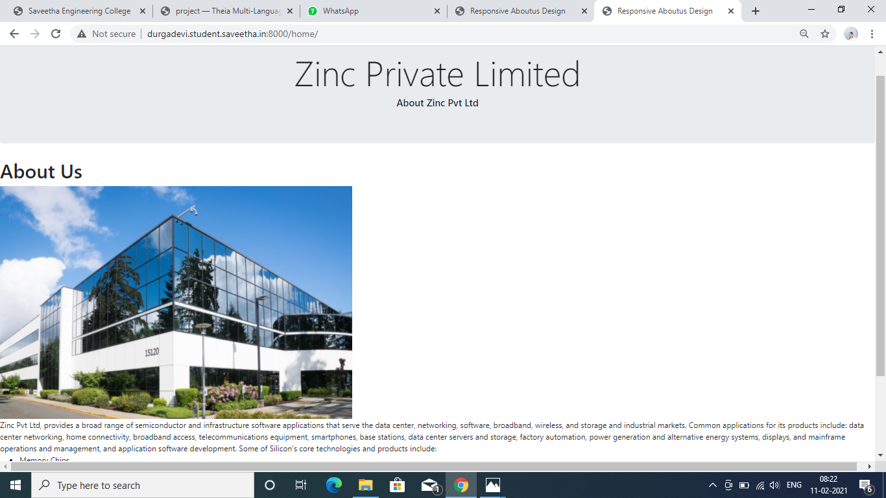

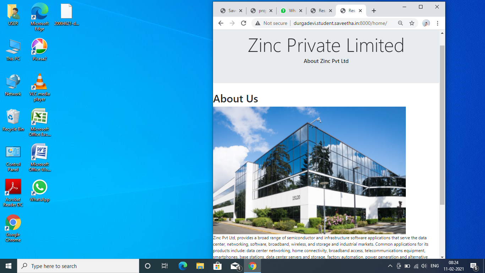

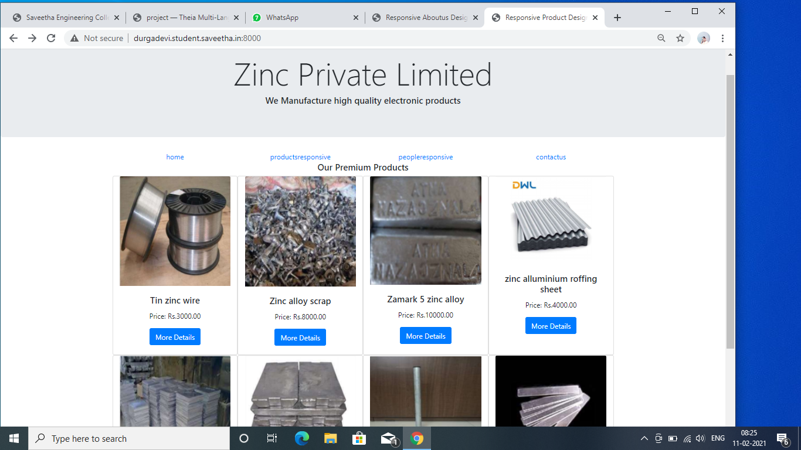

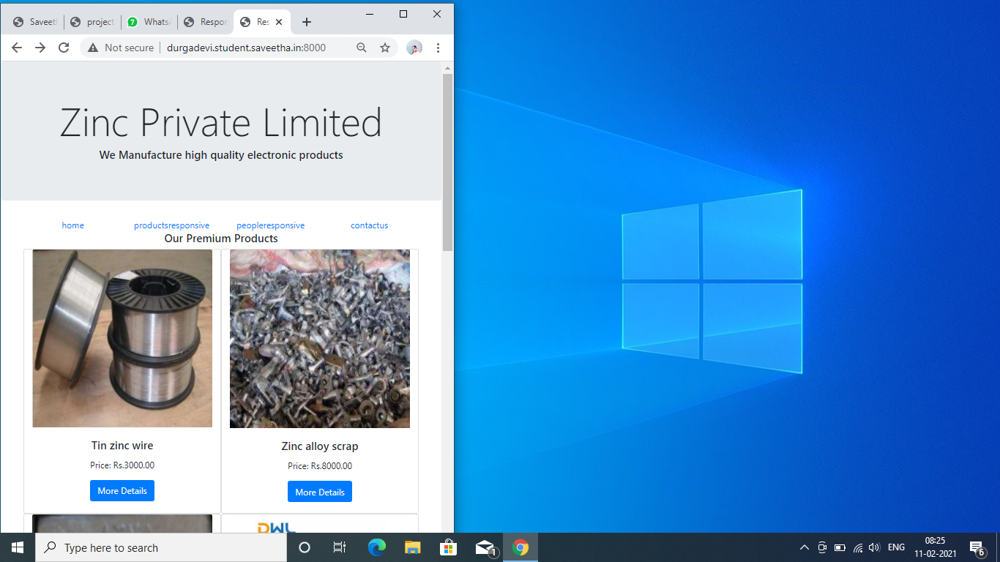

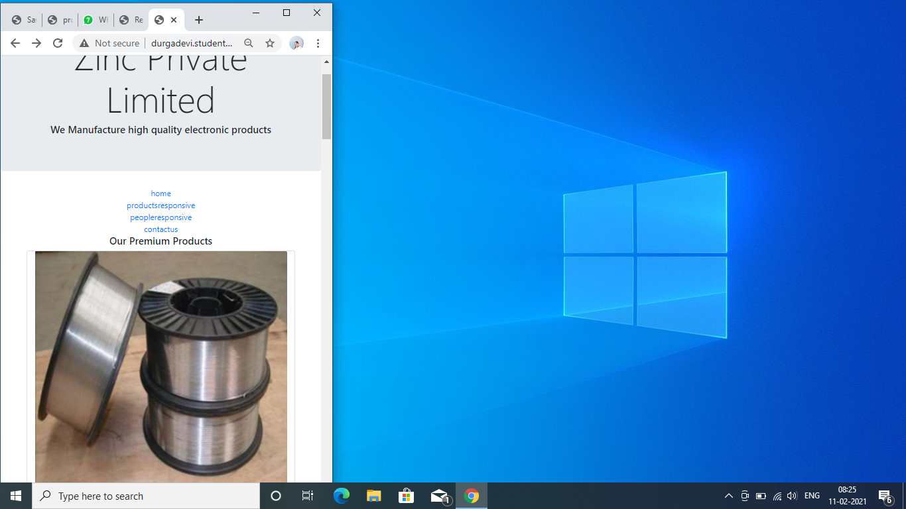

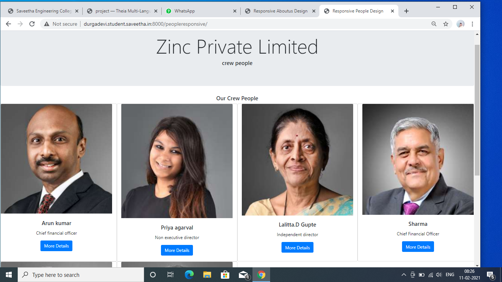

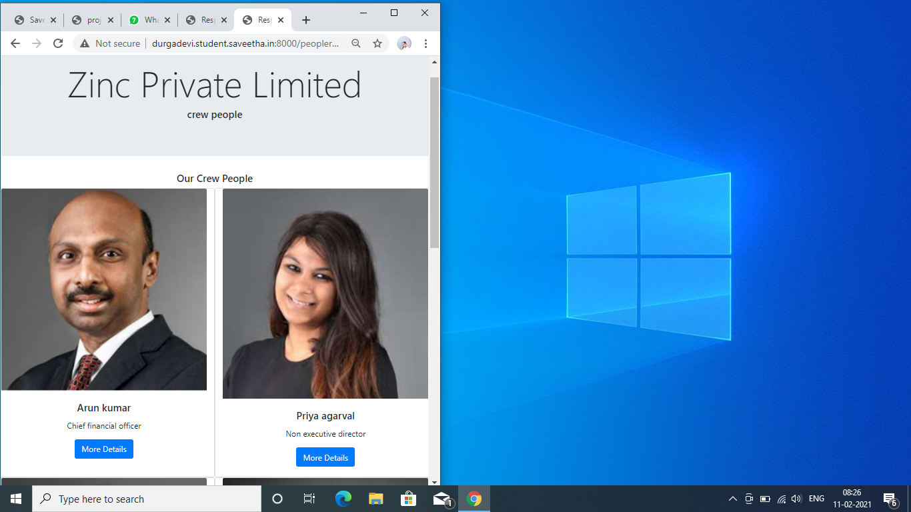

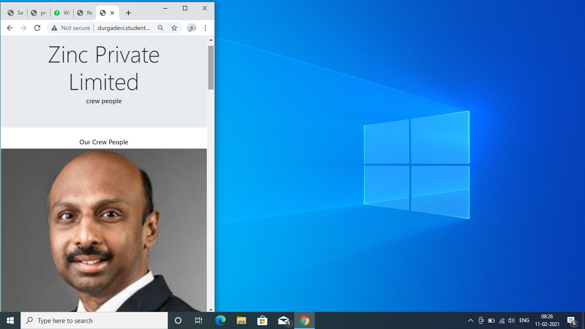

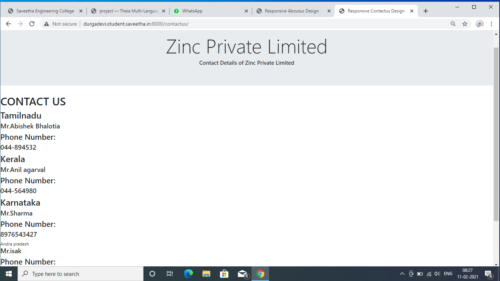

## CODE VALIDATION REPORT:


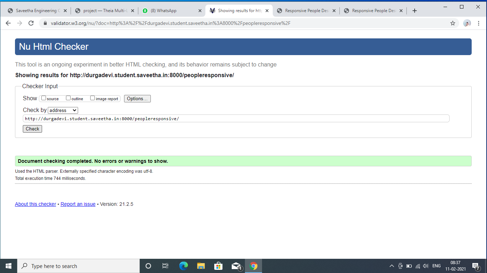

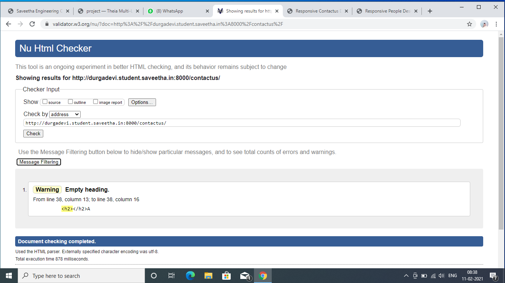

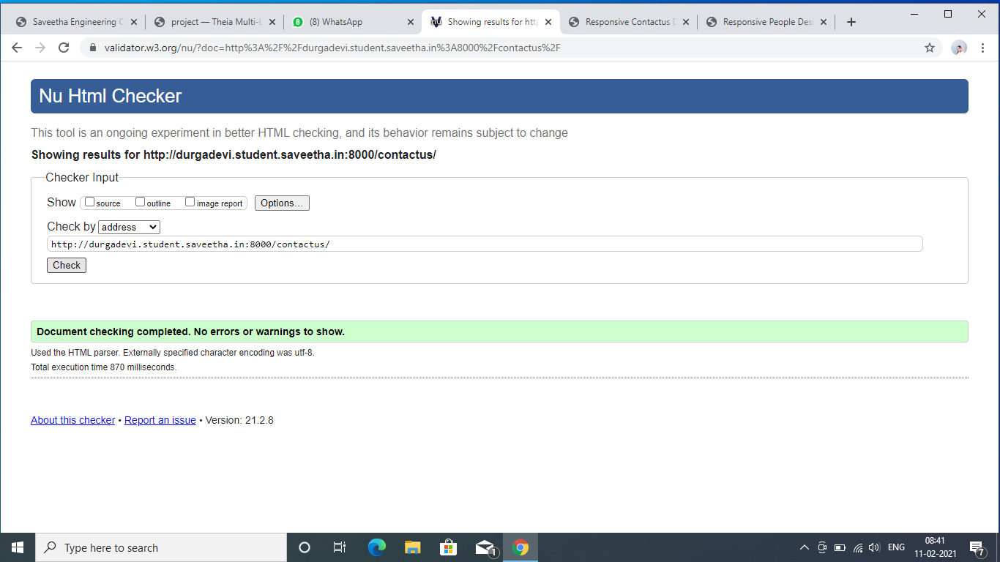


## RESULT:
Thus a website is designed for the  responsive with two break points and is hosted in the URL http://durgadevi.student.saveetha.in:8000/productsresponsive. HTML code is validated.


